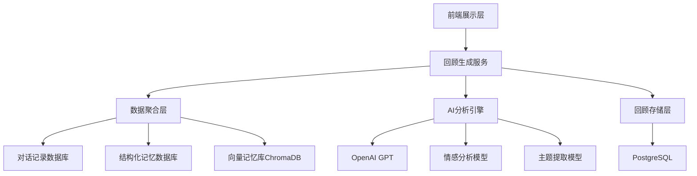
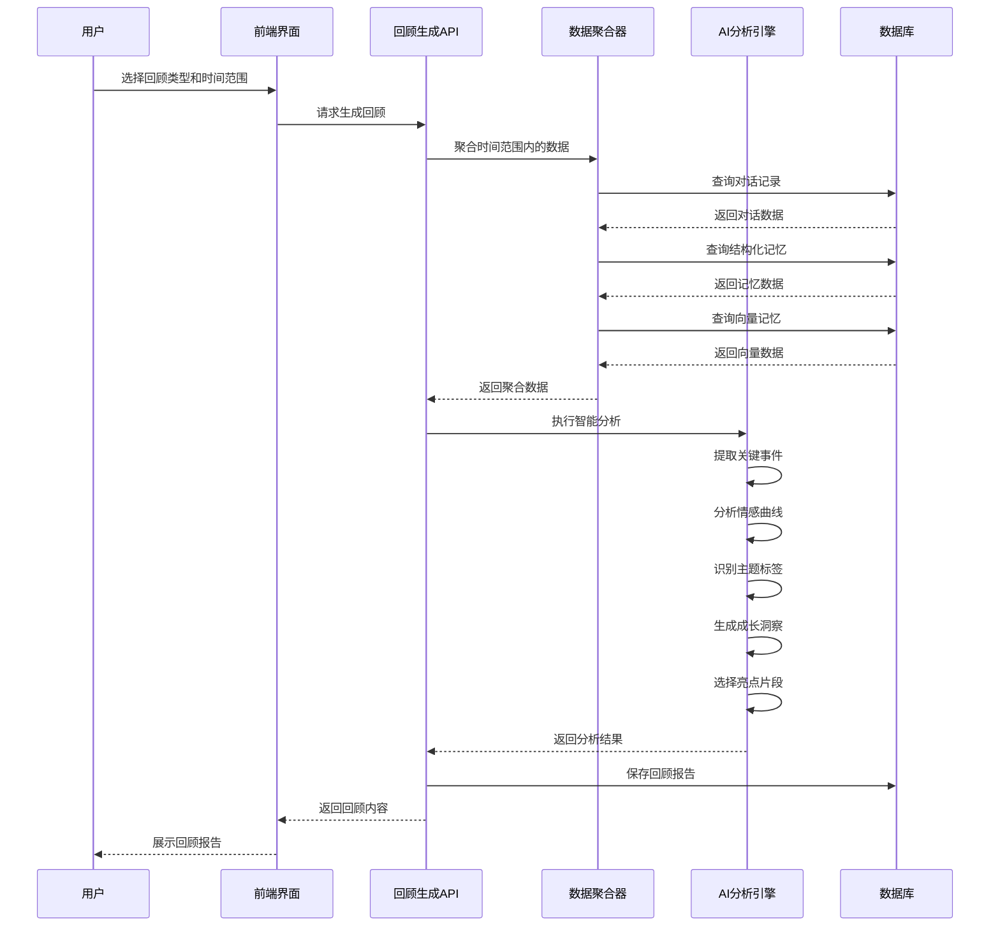
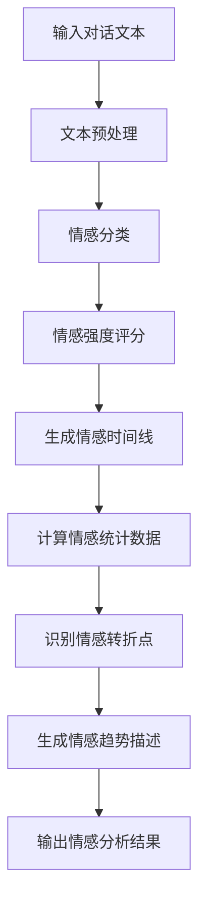
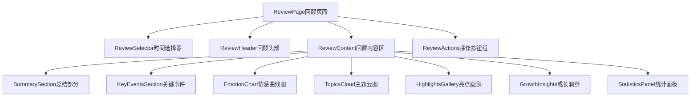

# 年度回顾和月度回顾功能设计文档

## 1. 功能概述

### 1.1 功能定位
年度回顾和月度回顾功能是"记忆回响"系统的时间线回顾模块,通过智能分析用户在特定时间段内的对话记录和记忆数据,自动生成个性化的回顾报告,帮助用户梳理人生轨迹,发现生活模式,并深化自我认知。

### 1.2 核心价值
- **时间维度的记忆聚合**:将碎片化的日常记忆按时间维度重新组织
- **智能洞察生成**:通过AI分析识别重要时刻、情感变化和生活主题
- **可视化呈现**:以图表、时间线等形式直观展示回顾内容
- **持续性叙事**:为最终回忆录生成提供按时间组织的素材

### 1.3 用户场景
- 用户在月末查看本月的记忆亮点和情感曲线
- 用户在年末回顾全年的重要事件和成长变化
- 用户对比不同时期的生活状态和心理状态
- 用户将回顾内容纳入完整回忆录的章节素材

## 2. 技术架构

### 2.1 系统架构图



### 2.2 组件职责

| 组件名称 | 职责描述 |
|---------|---------|
| 前端展示层 | 提供回顾查看、筛选、导出界面,包含时间选择器和可视化组件 |
| 回顾生成服务 | 协调数据聚合和AI分析,生成完整的回顾报告 |
| 数据聚合层 | 从多个数据源收集指定时间范围内的记忆数据 |
| AI分析引擎 | 执行内容分析、主题提取、情感分析、亮点识别 |
| 回顾存储层 | 持久化已生成的回顾报告,支持历史查阅 |

## 3. 数据模型设计

### 3.1 回顾报告数据模型

| 字段名 | 数据类型 | 说明 |
|-------|---------|------|
| id | Integer | 回顾报告唯一标识 |
| user_id | Integer | 用户ID,外键关联用户表 |
| review_type | String | 回顾类型:monthly(月度)或annual(年度) |
| period_start | DateTime | 回顾周期起始时间 |
| period_end | DateTime | 回顾周期结束时间 |
| summary | Text | AI生成的总结性描述 |
| key_events | JSON | 关键事件列表 |
| emotion_analysis | JSON | 情感分析数据 |
| topics | JSON | 主题标签和权重 |
| statistics | JSON | 统计数据 |
| highlights | JSON | 亮点记忆片段 |
| growth_insights | JSON | 成长洞察 |
| visualization_data | JSON | 可视化图表数据 |
| generated_at | DateTime | 生成时间 |
| status | String | 状态:draft(草稿)、completed(已完成) |

### 3.2 关键事件数据结构

```json
{
  "key_events": [
    {
      "event_id": "唯一标识",
      "title": "事件标题",
      "date": "事件日期",
      "description": "事件描述",
      "importance_score": "重要性评分(0-10)",
      "emotion": "关联情感",
      "related_memories": ["记忆ID列表"]
    }
  ]
}
```

### 3.3 情感分析数据结构

```json
{
  "emotion_analysis": {
    "overall_sentiment": {
      "positive": "正面情感占比",
      "neutral": "中性情感占比",
      "negative": "负面情感占比"
    },
    "emotion_timeline": [
      {
        "date": "日期",
        "sentiment_score": "情感分数(-1到1)",
        "dominant_emotion": "主导情感"
      }
    ],
    "emotion_trends": "情感变化趋势描述"
  }
}
```

### 3.4 主题分布数据结构

```json
{
  "topics": [
    {
      "topic_name": "主题名称",
      "weight": "主题权重(0-1)",
      "frequency": "出现频次",
      "related_dates": ["相关日期列表"],
      "description": "主题描述"
    }
  ]
}
```

## 4. 业务逻辑设计

### 4.1 回顾生成流程



### 4.2 数据聚合逻辑

#### 4.2.1 时间范围确定规则

| 回顾类型 | 时间范围计算规则 |
|---------|----------------|
| 月度回顾 | 从指定月份的第一天00:00:00到最后一天23:59:59 |
| 年度回顾 | 从指定年份的1月1日00:00:00到12月31日23:59:59 |

#### 4.2.2 数据源查询策略

**对话记录查询**
- 筛选条件:用户ID匹配且消息时间戳在指定时间范围内
- 包含内容:用户消息和AI助手回复
- 排序方式:按时间戳升序排列

**结构化记忆查询**
- 筛选条件:用户ID匹配且创建时间在指定时间范围内
- 包含类型:人物、地点、事件等所有实体类型
- 关联关系:提取实体间的关联信息

**向量记忆查询**
- 筛选条件:根据元数据中的用户ID和时间戳筛选
- 检索方式:通过时间范围过滤,不进行语义检索

### 4.3 AI分析引擎逻辑

#### 4.3.1 关键事件提取

**提取规则**
1. 识别标志性关键词(如"第一次"、"重要"、"难忘"、"转折")
2. 检测情感强度峰值对应的对话片段
3. 识别结构化记忆中的重大事件类型实体
4. 通过语义相似度聚类识别反复提及的话题
5. 按重要性评分排序,选取Top 5-10个事件

**重要性评分算法**
- 情感强度权重:30%
- 提及频次权重:25%
- 时间跨度权重:20%
- 关联记忆数量权重:15%
- 用户主动标记权重:10%

#### 4.3.2 情感分析流程



**情感分类维度**
- 基础维度:正面、中性、负面
- 细粒度情感:快乐、感动、平静、焦虑、悲伤、愤怒等

#### 4.3.3 主题提取策略

**提取方法**
1. 使用TF-IDF算法提取高频关键词
2. 基于关键词聚类识别主题簇
3. 利用预定义主题标签库进行匹配
4. 通过语义模型识别隐含主题

**预定义主题库示例**

| 主题类别 | 主题标签示例 |
|---------|------------|
| 家庭关系 | 亲子教育、夫妻相处、长辈关怀、家庭聚会 |
| 职业发展 | 工作挑战、职业转型、技能提升、团队协作 |
| 健康生活 | 运动健身、饮食调理、心理健康、医疗保健 |
| 兴趣爱好 | 旅行探索、艺术创作、阅读学习、美食烹饪 |
| 社交关系 | 朋友相聚、社群活动、人际冲突、情感支持 |
| 个人成长 | 自我反思、价值观探索、习惯养成、目标实现 |

#### 4.3.4 亮点片段选择

**选择标准**
- 情感共鸣度高的对话片段
- 叙事完整且生动的记忆描述
- 包含具体细节的场景回忆
- 体现用户个性特征的表达
- 具有代表性的成长时刻

**片段长度控制**
- 月度回顾:选择3-5个亮点片段,每个片段50-150字
- 年度回顾:选择8-12个亮点片段,每个片段100-200字

#### 4.3.5 成长洞察生成

**洞察维度**

| 维度名称 | 分析内容 |
|---------|---------|
| 行为模式变化 | 对比期初和期末的行为习惯差异 |
| 情感成熟度 | 分析情绪管理能力的提升 |
| 关系网络演变 | 识别重要关系的深化或淡化 |
| 价值观变迁 | 发现关注重点和优先级的转变 |
| 能力成长 | 总结新技能学习和能力提升 |

**生成策略**
- 采用对比分析方法识别变化
- 使用自然语言生成温暖的描述性文字
- 提供具体的支撑性证据或示例
- 以鼓励和肯定的语气呈现

## 5. 前端界面设计

### 5.1 回顾页面组件结构



### 5.2 时间选择器交互逻辑

**月度回顾选择器**
- 展示形式:年份下拉菜单 + 月份网格选择器
- 默认值:当前月份的上一个月
- 可选范围:用户注册日期至当前月份
- 快捷选项:本月、上月、最近3个月

**年度回顾选择器**
- 展示形式:年份列表选择器
- 默认值:当前年份的上一年
- 可选范围:用户注册年份至当前年份
- 快捷选项:今年、去年、前年

### 5.3 可视化组件设计

#### 5.3.1 情感曲线图

**图表类型**:折线图或面积图

**数据维度**
- X轴:时间(日期)
- Y轴:情感分数(-1到1)
- 颜色映射:正面情感(绿色)、中性(灰色)、负面(橙色)

**交互特性**
- 悬停显示具体日期和情感分数
- 点击曲线上的点展示当天的对话摘要
- 支持时间范围缩放查看细节

#### 5.3.2 主题云图

**图表类型**:词云图或气泡图

**展示规则**
- 字体大小或气泡尺寸与主题权重成正比
- 颜色按主题类别区分
- 鼠标悬停显示主题详细信息和频次

**交互特性**
- 点击主题标签筛选相关记忆
- 支持主题标签的隐藏和显示切换

#### 5.3.3 时间线组件

**展示形式**:垂直或水平时间轴

**内容元素**
- 时间节点:标注日期
- 事件卡片:显示事件标题和简要描述
- 连接线:表示时间流动
- 情感图标:用图标表示事件的情感色彩

**交互特性**
- 点击事件卡片展开完整详情
- 支持时间线的滚动浏览
- 提供时间段跳转快捷按钮

### 5.4 统计面板内容

**月度回顾统计指标**

| 指标名称 | 计算方式 |
|---------|---------|
| 对话次数 | 统计该月的对话会话数量 |
| 记忆片段数 | 统计新增的记忆条目数量 |
| 活跃天数 | 统计有对话记录的天数 |
| 平均对话长度 | 计算每次对话的平均消息数 |
| 最长对话日 | 识别对话消息最多的日期 |
| 情感积极度 | 计算正面情感占比 |

**年度回顾统计指标**

| 指标名称 | 计算方式 |
|---------|---------|
| 全年对话总数 | 统计全年的对话会话数量 |
| 记忆总量 | 统计全年新增的记忆条目总数 |
| 最活跃月份 | 识别对话次数最多的月份 |
| 年度关键词Top10 | 提取全年高频关键词 |
| 情感起伏度 | 计算情感曲线的标准差 |
| 主题多样性 | 统计涉及的不同主题数量 |
| 成长里程碑数 | 统计标记为重要成长的事件数 |

## 6. API接口设计

### 6.1 生成回顾报告接口

**接口描述**:触发回顾报告的生成流程

| 属性 | 值 |
|-----|---|
| 请求方法 | POST |
| 请求路径 | /api/reviews/generate |
| 认证要求 | 需要用户身份认证令牌 |

**请求参数**

| 参数名 | 类型 | 必填 | 说明 |
|-------|------|------|------|
| review_type | String | 是 | 回顾类型:monthly或annual |
| year | Integer | 是 | 年份 |
| month | Integer | 否 | 月份(月度回顾必填) |
| regenerate | Boolean | 否 | 是否强制重新生成,默认false |

**响应数据结构**

| 字段名 | 类型 | 说明 |
|-------|------|------|
| review_id | Integer | 回顾报告ID |
| status | String | 生成状态:processing或completed |
| message | String | 提示信息 |

**业务逻辑**
1. 验证用户身份和权限
2. 检查是否已存在相同时间段的回顾报告
3. 如果存在且regenerate为false,直接返回已有报告ID
4. 如果不存在或regenerate为true,启动异步生成任务
5. 返回任务状态和回顾报告ID

### 6.2 查询回顾报告接口

**接口描述**:获取已生成的回顾报告详情

| 属性 | 值 |
|-----|---|
| 请求方法 | GET |
| 请求路径 | /api/reviews/{review_id} |
| 认证要求 | 需要用户身份认证令牌 |

**路径参数**

| 参数名 | 类型 | 说明 |
|-------|------|------|
| review_id | Integer | 回顾报告ID |

**响应数据结构**

返回完整的回顾报告数据,包含所有字段(参见3.1节数据模型)

**业务逻辑**
1. 验证用户身份
2. 检查review_id是否属于当前用户
3. 返回回顾报告的完整数据
4. 如果报告不存在或无权访问,返回错误

### 6.3 回顾列表查询接口

**接口描述**:获取用户的所有回顾报告列表

| 属性 | 值 |
|-----|---|
| 请求方法 | GET |
| 请求路径 | /api/reviews |
| 认证要求 | 需要用户身份认证令牌 |

**请求参数**

| 参数名 | 类型 | 必填 | 说明 |
|-------|------|------|------|
| review_type | String | 否 | 筛选回顾类型:monthly、annual或all(默认) |
| year | Integer | 否 | 筛选指定年份 |
| page | Integer | 否 | 页码,默认1 |
| page_size | Integer | 否 | 每页数量,默认10 |

**响应数据结构**

| 字段名 | 类型 | 说明 |
|-------|------|------|
| total | Integer | 总记录数 |
| page | Integer | 当前页码 |
| page_size | Integer | 每页数量 |
| reviews | Array | 回顾报告列表 |

**reviews数组元素结构**

| 字段名 | 类型 | 说明 |
|-------|------|------|
| review_id | Integer | 回顾报告ID |
| review_type | String | 回顾类型 |
| period_start | DateTime | 周期起始时间 |
| period_end | DateTime | 周期结束时间 |
| summary | String | 摘要(前200字) |
| generated_at | DateTime | 生成时间 |
| status | String | 状态 |

### 6.4 删除回顾报告接口

**接口描述**:删除指定的回顾报告

| 属性 | 值 |
|-----|---|
| 请求方法 | DELETE |
| 请求路径 | /api/reviews/{review_id} |
| 认证要求 | 需要用户身份认证令牌 |

**路径参数**

| 参数名 | 类型 | 说明 |
|-------|------|------|
| review_id | Integer | 回顾报告ID |

**响应数据结构**

| 字段名 | 类型 | 说明 |
|-------|------|------|
| success | Boolean | 是否删除成功 |
| message | String | 提示信息 |

### 6.5 导出回顾报告接口

**接口描述**:将回顾报告导出为指定格式文件

| 属性 | 值 |
|-----|---|
| 请求方法 | GET |
| 请求路径 | /api/reviews/{review_id}/export |
| 认证要求 | 需要用户身份认证令牌 |

**路径参数**

| 参数名 | 类型 | 说明 |
|-------|------|------|
| review_id | Integer | 回顾报告ID |

**请求参数**

| 参数名 | 类型 | 必填 | 说明 |
|-------|------|------|------|
| format | String | 是 | 导出格式:pdf、docx、markdown |

**响应**
- 成功:返回文件流,浏览器触发下载
- 失败:返回错误信息JSON

## 7. 业务规则与约束

### 7.1 生成时机规则

**自动生成触发条件**
- 月度回顾:每月1日自动为上月生成回顾报告
- 年度回顾:每年1月1日自动为上一年生成回顾报告

**手动生成限制**
- 只能为已结束的时间段生成回顾(不能为当前月份或当前年份生成)
- 同一时间段的回顾报告每24小时内只允许重新生成一次

### 7.2 数据量阈值

**最小数据要求**

| 回顾类型 | 最小对话次数 | 最小记忆数量 |
|---------|------------|------------|
| 月度回顾 | 5次 | 3条 |
| 年度回顾 | 20次 | 10条 |

如果数据量不足,系统提示"记忆数据较少,回顾内容可能不够丰富",但仍允许生成。

### 7.3 内容质量保证

**AI生成内容审核**
- 过滤敏感词汇和不当表达
- 确保生成文本的连贯性和逻辑性
- 验证事件提取的准确性

**用户编辑权限**
- 用户可以编辑AI生成的总结文字
- 用户可以手动添加或删除关键事件
- 用户可以调整亮点片段的选择
- 编辑后的内容标记为"用户定制版"

### 7.4 隐私与数据安全

**数据访问控制**
- 回顾报告仅对报告所有者可见
- 导出的文件不包含敏感的系统元数据
- 删除回顾报告不影响原始对话和记忆数据

**匿名化处理**
- 在导出分享版本时,可选择匿名化人名和地名
- 系统不会在未经授权的情况下分享回顾内容

## 8. 性能与扩展性考虑

### 8.1 性能优化策略

**异步处理**
- 回顾生成采用异步任务队列(如Celery)
- 前端通过轮询或WebSocket获取生成进度
- 大数据量用户的回顾生成可能需要数分钟

**缓存机制**
- 已生成的回顾报告缓存在Redis中,加速查询
- 可视化数据单独缓存,减少重复计算
- 缓存过期时间:24小时

**数据分页**
- 回顾列表查询实施分页
- 关键事件和亮点片段在前端实施虚拟滚动

### 8.2 扩展性设计

**插件化分析模块**
- AI分析引擎采用插件架构,便于添加新的分析维度
- 支持第三方分析算法的集成

**多语言支持**
- 情感分析和主题提取支持多语言扩展
- 回顾报告的生成文本支持国际化

**自定义回顾模板**
- 未来可支持用户自定义回顾报告的结构和内容
- 提供多种预设模板供用户选择

## 9. 测试策略

### 9.1 单元测试

**测试范围**
- 数据聚合逻辑的正确性
- 时间范围计算的准确性
- 情感分析评分算法
- 主题提取去重逻辑
- 重要性评分算法

**测试方法**
- 使用模拟数据验证各个函数的输入输出
- 边界条件测试(如空数据、极端日期)

### 9.2 集成测试

**测试场景**
- 完整的回顾生成流程端到端测试
- 多数据源聚合的协调性测试
- API接口的请求响应正确性测试

### 9.3 用户验收测试

**测试目标**
- 回顾内容的准确性和相关性
- 用户界面的易用性和美观性
- 生成速度是否在可接受范围内

**测试方法**
- 邀请真实用户进行试用并收集反馈
- A/B测试不同的内容生成策略
- 可用性测试评估界面交互流程

## 10. 与现有功能的集成

### 10.1 与回忆录生成的关联

**素材复用**
- 回顾报告中的关键事件和亮点片段可作为回忆录章节素材
- 用户可将回顾报告直接导入回忆录编辑器
- 回忆录生成时可参考历史回顾报告的结构

**集成方式**
- 在回忆录页面提供"从回顾导入"按钮
- 支持选择多个回顾报告批量导入
- 导入时自动转换为回忆录的Markdown格式

### 10.2 与记忆库的交互

**双向关联**
- 回顾报告中展示的事件可跳转到记忆库查看详情
- 记忆库中的记忆条目显示所属的回顾报告

**记忆增强**
- 用户在查看回顾时可以补充新的记忆细节
- 新增的记忆自动关联到对应的回顾报告

### 10.3 与对话功能的协同

**对话引导**
- AI在日常对话中适时提醒用户查看回顾
- 在重要时间节点(如月末、年末)主动生成回顾

**对话反馈**
- 用户对回顾报告的反馈可影响后续对话的引导策略
- AI根据回顾中识别的兴趣主题调整对话话题

## 11. 未来演进方向

### 11.1 短期优化(3-6个月)

- 增加周回顾功能,提供更高频的回顾维度
- 优化情感分析的准确性,引入更细粒度的情感分类
- 增加回顾报告的对比功能,支持跨时间段对比

### 11.2 中期扩展(6-12个月)

- 支持自定义回顾周期(如季度回顾、特定日期范围回顾)
- 引入多媒体元素,在回顾中展示用户上传的照片和音频
- 开发移动端原生应用,优化移动设备上的回顾体验

### 11.3 长期愿景(12个月以上)

- AI主动发现用户生活模式并提供个性化建议
- 支持多人共享回顾(如家庭共同回顾)
- 开发AR/VR沉浸式回顾体验,让用户"重返"记忆场景
